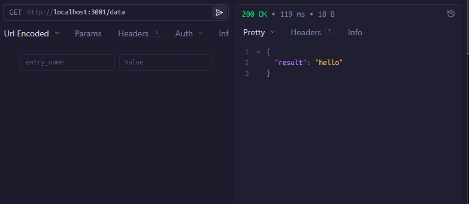
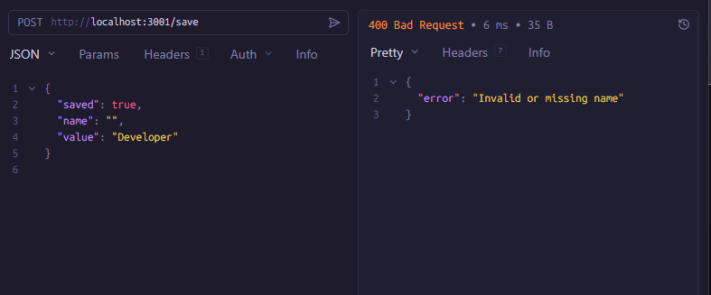
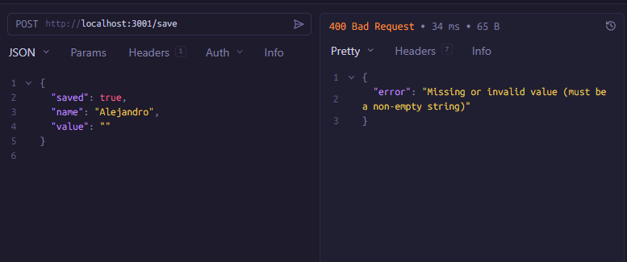
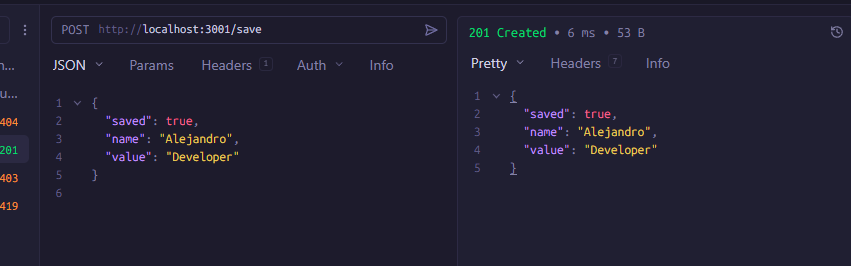

# Solución — Depuración de Backend (Backend Debug)

## 🐛 Errores Encontrados y Solucionados

### 1. Falta de `await` en `GET /data`
- **Causa:** La función `getDataFromDB()` es asíncrona y devuelve una Promesa. Al llamarla sin `await`, la variable `data` guardaba el objeto Promise en lugar del resultado esperado.
- **Solución:** Se añadió `await` a la llamada para esperar la resolución de la base de datos simulada.

### 2. Propiedad de respuesta incorrecta en `GET /data`
- **Causa:** El endpoint intentaba enviar al cliente `data.result`, pero la estructura que retorna la función es `{ id: 1, value: 'hello' }`.
- **Solución:** Se cambió para que la respuesta JSON envíe el valor correcto usando `data.value`.

### 3. Códigos de Estado y validación de "No encontrado"
- **Causa:** Si la base de datos no encontraba información, el servidor intentaba procesar datos inexistentes en lugar de avisar al cliente.
- **Solución:** Se implementó una validación `if (!data)` que detiene la ejecución y retorna el código `404 Not Found`.

### 4. Falta de Validación de Entrada en `POST /save`
- **Causa:** El endpoint aceptaba cualquier payload de entrada ciegamente. Esto es un fallo de seguridad y consistencia, ya que se pueden guardar datos corruptos.
- **Solución:** Se añadieron validaciones estrictas: se verifica que tanto `name` como `value` sean textos válidos (strings no vacíos). Si fallan, retorna `400 Bad Request`. Además, se ajustó la respuesta exitosa a `201 Created`.

### 5. Fuga de Memoria (Memory Leak) en el Log Global
- **Causa:** El arreglo global `requestLog` empujaba un nuevo objeto por cada petición, creciendo de manera infinita y consumiendo toda la RAM con el tiempo.
- **Solución:** Se estableció un tamaño máximo (`MAX_LOG_SIZE = 100`). Si el arreglo supera este límite, se elimina el log más antiguo usando `.shift()`.

### 6. Ausencia de Manejo Global de Errores
- **Causa:** Cualquier excepción asíncrona no capturada tumbaría el servidor o dejaría la petición colgada.
- **Solución:** Se envolvió la lógica en bloques `try/catch` llamando a `next(error)` y se agregó un middleware global de errores que responde de manera segura con un `500 Internal Server Error`.

---

## 🧪 Pruebas de Funcionamiento

A continuación se evidencia el correcto comportamiento de la API frente a escenarios de éxito y manejo de errores.

### GET `/data` (Prueba Correcta)

### POST `/save` (Validación de Error: Falta Nombre o Inválido)

### POST `/save` (Validación de Error: Falta Valor)

### POST `/save` (Prueba Correcta)

---
  

# Solution — Backend Debug

## 🐛 Bugs Found & Fixed

### 1. Missing `await` in `GET /data`
- **Root Cause:** The `getDataFromDB()` function is asynchronous, but it was called without `await`. This resulted in the `data` variable holding a Promise object instead of the actual data.
- **Fix:** Added the `await` keyword to properly pause execution until the promise resolves.

### 2. Incorrect Response Property in `GET /data`
- **Root Cause:** The code tried to return `data.result`, but the simulated database function actually returns an object shaped like `{ id: 1, value: 'hello' }`.
- **Fix:** Updated the response to map to `data.value`.

### 3. Missing 404 Status Handling
- **Root Cause:** If the database returned no data, the API would attempt to process it anyway.
- **Fix:** Added an `if (!data)` check that immediately returns a `404 Not Found` response to the client.

### 4. Lack of Input Validation on `POST /save`
- **Root Cause:** The endpoint blindly accepted any JSON payload, risking corrupted data and server crashes.
- **Fix:** Implemented strict input validations. It now verifies that both `name` and `value` are valid, non-empty strings. If validation fails, it returns `400 Bad Request`. Successful creations now appropriately return `201 Created`.

### 5. Memory Leak in Global Request Logger
- **Root Cause:** The global `requestLog` array pushed every incoming request indefinitely, which would eventually lead to a memory leak and server crash.
- **Fix:** Added a `MAX_LOG_SIZE` constant set to 100. When the limit is reached, it uses `.shift()` to discard the oldest entries, keeping memory usage stable.

### 6. No Global Error Handling Middleware
- **Root Cause:** Unhandled exceptions within the routes could crash the Node instance or cause hanging requests.
- **Fix:** Wrapped the logic in `try/catch` blocks forwarding to `next(error)`, and added a centralized error-handling middleware at the bottom to safely return a `500 Internal Server Error`.

---

## 🧪 Testing Evidence

Below is the evidence of the API correctly handling both success scenarios and boundary/error cases.

### GET `/data` (Success)

### POST `/save` (Validation Error: Missing/Invalid Name)

### POST `/save` (Validation Error: Missing Value)

### POST `/save` (Success)

